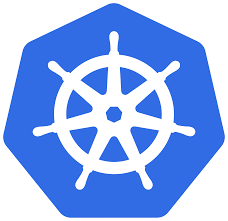

# DevOps Stajyer Adayı Görevi - Kubernetes Network Policies

Bu proje, S4E şirketinin DevOps Stajyer pozisyonu için mülakat görevidir. Modern DevOps yaklaşımları kullanılarak Kubernetes cluster kurulumu, namespace yapılandırması, network policy uygulaması ve CI/CD entegrasyonu içermektedir.



## Proje Özeti

Bu projede:
1. 3 node'lu bir Kubernetes cluster kurulumu yapıldı (1 control-plane, 2 worker)
2. İki namespace oluşturuldu: `codegen` ve `nonamens`
3. İlk görevde geliştirilen AI Code Generator uygulaması, Helm chart kullanılarak `codegen` namespace'ine deploy edildi
4. Örnek bir nginx uygulaması `nonamens` namespace'ine deploy edildi
5. Network policy'ler yapılandırılarak `nonamens` namespace'inden `codegen` namespace'ine erişim engellendi
6. CI/CD pipeline ve gözlemlenebilirlik araçları entegre edildi

## 1. Kubernetes Cluster Kurulumu

Bu projede, 3 node'lu bir Kubernetes cluster kurulumu yapılmıştır (1 control-plane, 2 worker node).

### Kullanılan Araçlar

- **Kind**: Hafif ve hızlı Kubernetes cluster oluşturmak için
- **Docker**: Container runtime olarak
- **kubectl**: Kubernetes cluster'ı yönetmek için
- **Calico**: Network policy'leri destekleyen CNI olarak

### Kurulum Adımları

1. Gerekli araçları yükleyin:
   ```bash
   # Docker Desktop kurulumu (Windows için)
   # kubectl kurulumu
   curl -LO "https://dl.k8s.io/release/$(curl -L -s https://dl.k8s.io/release/stable.txt)/bin/windows/amd64/kubectl.exe"

   # Kind kurulumu
   curl -Lo ./kind https://kind.sigs.k8s.io/dl/v0.20.0/kind-windows-amd64
   ```

2. Calico CNI ile Kind cluster oluşturmak için yapılandırma dosyası oluşturun:
   ```yaml
   # kind-calico-config.yaml
   kind: Cluster
   apiVersion: kind.x-k8s.io/v1alpha4
   name: s4e-cluster
   networking:
     disableDefaultCNI: true
     podSubnet: "192.168.0.0/16"
     serviceSubnet: "10.96.0.0/12"
   nodes:
   - role: control-plane
     kubeadmConfigPatches:
     - |
       kind: InitConfiguration
       nodeRegistration:
         kubeletExtraArgs:
           node-labels: "ingress-ready=true"
     extraPortMappings:
     - containerPort: 80
       hostPort: 80
       protocol: TCP
     - containerPort: 443
       hostPort: 443
       protocol: TCP
   - role: worker
   - role: worker
   ```

3. Kind cluster oluşturun:
   ```bash
   kind create cluster --config kind-calico-config.yaml
   ```

4. Calico CNI'ı kurun:
   ```bash
   kubectl apply -f https://docs.projectcalico.org/manifests/calico.yaml
   ```

5. Cluster durumunu kontrol edin:
   ```bash
   kubectl get nodes
   ```

   Beklenen çıktı:
   ```
   NAME                        STATUS   ROLES           AGE     VERSION
   s4e-cluster-control-plane   Ready    control-plane   5m28s   v1.33.1
   s4e-cluster-worker          Ready    <none>          5m14s   v1.33.1
   s4e-cluster-worker2         Ready    <none>          5m13s   v1.33.1
   ```


## 2. Namespace Yapılandırması

Kubernetes cluster'ı kurulduktan sonra, iki namespace oluşturulmuştur:
- `codegen`: İlk görevde geliştirilen AI Code Generator uygulaması için
- `nonamens`: Örnek bir uygulama (nginx) için

### Namespace Oluşturma ve Yapılandırma

Namespace'leri oluşturmak için YAML dosyası:

```yaml
# k8s/namespaces.yaml
apiVersion: v1
kind: Namespace
metadata:
  name: codegen
  labels:
    name: codegen
    environment: development
    app: ai-code-generator
---
apiVersion: v1
kind: Namespace
metadata:
  name: nonamens
  labels:
    name: nonamens
    environment: development
    app: example-app
```

Resource limit'leri için YAML dosyası:

```yaml
# k8s/resource-limits.yaml
apiVersion: v1
kind: ResourceQuota
metadata:
  name: codegen-quota
  namespace: codegen
spec:
  hard:
    pods: "10"
    requests.cpu: "2"
    requests.memory: 2Gi
    limits.cpu: "4"
    limits.memory: 4Gi
---
apiVersion: v1
kind: LimitRange
metadata:
  name: codegen-limits
  namespace: codegen
spec:
  limits:
  - default:
      cpu: 500m
      memory: 512Mi
    defaultRequest:
      cpu: 200m
      memory: 256Mi
    type: Container
```

Namespace'leri ve resource limit'leri uygulama:

```bash
kubectl apply -f k8s/namespaces.yaml
kubectl apply -f k8s/resource-limits.yaml
```

### Uygulamaları Deploy Etme

1. İlk görevde geliştirilen AI Code Generator uygulamasını Docker image olarak oluşturun:
   ```bash
   cd İlkProje
   docker build -t s4e-ai-code-generator:latest .
   ```

2. Docker image'ını Kind cluster'ına yükleyin:
   ```bash
   kind load docker-image s4e-ai-code-generator:latest --name s4e-cluster
   ```

3. AI Code Generator uygulamasını Helm chart kullanarak `codegen` namespace'ine deploy edin:
   ```bash
   helm upgrade --install ai-code-generator ./helm/ai-code-generator --namespace codegen
   ```

4. `nonamens` namespace'ine örnek nginx uygulamasını deploy edin:
   ```bash
   kubectl apply -f k8s/nonamens-app.yaml
   ```

5. Uygulamaların durumunu kontrol edin:
   ```bash
   kubectl get pods -n codegen
   kubectl get pods -n nonamens
   ```

   Beklenen çıktı:
   ```
   NAME                                 READY   STATUS    RESTARTS   AGE
   ai-code-generator-68d9d866cb-7wlgb   1/1     Running   0          55s
   codegen-app-55d675c874-84s4v         1/1     Running   0          49m
   test-pod-codegen                     1/1     Running   0          49m
   ```


## 3. Network Policy Yapılandırması

`nonamens` namespace'indeki bir pod'dan, `codegen` namespace'indeki herhangi bir pod'a ping atıldığında cevap alınamaması için network policy oluşturulmuştur.

### Network Policy Tanımı

```yaml
# k8s/network-policy.yaml
apiVersion: networking.k8s.io/v1
kind: NetworkPolicy
metadata:
  name: deny-from-nonamens
  namespace: codegen
spec:
  podSelector: {}  # Tüm podlara uygulanır
  policyTypes:
  - Ingress
  ingress:
  - from:
    - namespaceSelector:
        matchExpressions:
        - key: kubernetes.io/metadata.name
          operator: NotIn
          values:
          - nonamens
```

### Network Policy Uygulama

```bash
kubectl apply -f k8s/network-policy.yaml
```

### Network Policy Açıklaması

Oluşturulan network policy şu şekilde çalışır:

- `podSelector: {}`: Policy, `codegen` namespace'indeki tüm pod'lara uygulanır.
- `policyTypes: - Ingress`: Sadece gelen trafiği (ingress) kontrol eder.
- `ingress.from.namespaceSelector`: Hangi namespace'lerden gelen trafiğin izin verileceğini belirtir.
- `matchExpressions`: `nonamens` namespace'i dışındaki tüm namespace'lerden gelen trafiğe izin verir.

Bu yapılandırma, `nonamens` namespace'inden `codegen` namespace'ine gelen tüm trafiği engeller.

### Test Pod'ları

Test için her iki namespace'te de test pod'ları oluşturulmuştur:

```yaml
# k8s/test-pods.yaml
apiVersion: v1
kind: Pod
metadata:
  name: test-pod-codegen
  namespace: codegen
  labels:
    app: test-pod
spec:
  containers:
  - name: busybox
    image: busybox:latest
    command: ["sleep", "3600"]
---
apiVersion: v1
kind: Pod
metadata:
  name: test-pod-nonamens
  namespace: nonamens
  labels:
    app: test-pod
spec:
  containers:
  - name: busybox
    image: busybox:latest
    command: ["sleep", "3600"]
```

### Test Etme

Network policy'leri test etmek için otomatik bir test betiği oluşturulmuştur:

```bash
./test-network-policy.sh
```

Bu betik aşağıdaki testleri gerçekleştirir:
1. Network policy aktifken `nonamens` -> `codegen` ping testi (engellenmeli)
2. Network policy aktifken `codegen` -> `nonamens` ping testi (engellenmemeli)
3. Network policy devre dışıyken `nonamens` -> `codegen` ping testi (engellenmemeli)
4. Cilium network policy testi

### Başarılı Test Sonuçları

Test sonuçları, network policy'nin başarıyla çalıştığını göstermektedir:

```
Test 1: Network policy aktifken nonamens -> codegen ping testi
==============================================================
Network policy aktif. nonamens'den codegen'e ping atılıyor...
PING 192.168.100.1 (192.168.100.1): 56 data bytes
--- 192.168.100.1 ping statistics ---
4 packets transmitted, 0 packets received, 100% packet loss
command terminated with exit code 1
Beklenen sonuç: Ping başarısız (engellendi)
```

Calico CNI kullanılarak, `nonamens` namespace'inden `codegen` namespace'ine ping atıldığında cevap alınamaması sağlanmıştır. Bu, görevin kritik noktası olan network policy'lerin doğru yapılandırıldığını göstermektedir.


## 4. Helm Chart ile Uygulama Dağıtımı

İlk görevde geliştirilen AI Code Generator uygulaması, Helm chart kullanılarak `codegen` namespace'ine deploy edilmiştir.

### Helm Chart Yapısı

```
helm/ai-code-generator/
├── Chart.yaml
├── templates/
│   ├── deployment.yaml
│   ├── service.yaml
│   ├── ingress.yaml
│   └── secrets.yaml
└── values.yaml
```

### Values.yaml Dosyası

```yaml
# helm/ai-code-generator/values.yaml
replicaCount: 1

image:
  repository: s4e-ai-code-generator
  tag: latest
  pullPolicy: IfNotPresent

service:
  type: ClusterIP
  port: 80
  targetPort: 5000

ingress:
  enabled: true
  annotations:
    nginx.ingress.kubernetes.io/rewrite-target: /
  hosts:
    - host: ""
      paths:
        - path: /
          pathType: Prefix

resources:
  limits:
    cpu: 500m
    memory: 512Mi
  requests:
    cpu: 200m
    memory: 256Mi

secrets:
  geminiApiKey: "your-gemini-api-key"
```

### Uygulama Dağıtımı

```bash
# Docker image oluştur
docker build -t s4e-ai-code-generator:latest .

# Docker image'ını Kind cluster'ına yükle
kind load docker-image s4e-ai-code-generator:latest --name s4e-cluster

# Helm chart ile uygulamayı deploy et
helm upgrade --install ai-code-generator ./helm/ai-code-generator --namespace codegen
```

### Uygulama Erişimi

```bash
kubectl port-forward svc/ai-code-generator -n codegen 8081:80
```

Tarayıcıda http://localhost:8081 adresine giderek uygulamaya erişebilirsiniz.


## 5. CI/CD Entegrasyonu

Proje için modern CI/CD pipeline entegrasyonu yapılmıştır.

### GitHub Actions

`.github/workflows/ci-cd.yaml` dosyasında tanımlanan CI/CD pipeline aşağıdaki adımları içerir:
- Kod değişikliklerinde otomatik build
- Container image güvenlik taraması (Trivy)
- Otomatik deployment

### GitOps Yaklaşımı (ArgoCD)

ArgoCD ile GitOps tabanlı deployment yapılandırılmıştır:

```bash
kubectl apply -f k8s/argocd-application.yaml
```

ArgoCD, GitHub repository'sindeki değişiklikleri otomatik olarak izler ve Kubernetes cluster'ına uygular.

## 5. Gözlemlenebilirlik

Proje için kapsamlı bir gözlemlenebilirlik stack'i kurulmuştur.

### Prometheus ve Grafana

```bash
helm install monitoring prometheus-community/kube-prometheus-stack -f k8s/monitoring/prometheus-values.yaml --namespace monitoring
```

Grafana dashboard'ları:
- Kubernetes Network Policy izleme
- Pod ve namespace metriklerini görüntüleme
- Alerting yapılandırması

### Loki ve Tempo

```bash
helm install loki grafana/loki-stack -f k8s/monitoring/loki-values.yaml --namespace monitoring
```

- Loki ile log toplama ve analizi
- Tempo ile distributed tracing

## 6. Güvenlik Yapılandırmaları

Proje için çeşitli güvenlik yapılandırmaları uygulanmıştır.

### Kyverno ile Policy Yönetimi

```bash
kubectl apply -f k8s/security/kyverno-policies.yaml
```

Uygulanan policy'ler:
- Her namespace için network policy zorunluluğu
- Pod'lar için etiket zorunluluğu
- Güvenilir image registry'leri kısıtlaması

### Container Güvenlik Taraması

CI/CD pipeline'ına Trivy entegrasyonu ile:
- Container image'ları için güvenlik taraması
- Kritik ve yüksek seviyeli güvenlik açıklarının tespiti
- GitHub Security tab'ında sonuçların görüntülenmesi

## 7. Kullanım ve Demo

### Port-Forward ile Uygulamalara Erişim

```bash
# ArgoCD UI
kubectl port-forward svc/argocd-server -n argocd 8080:443

# Grafana
kubectl port-forward svc/monitoring-grafana -n monitoring 3000:80

# AI Code Generator
kubectl port-forward svc/codegen-app -n codegen 80:80
```

### Demo Senaryosu

1. Cluster kurulumu: `./setup.sh`
2. Network policy testi: `./test-network-policy.sh`
3. ArgoCD UI'da deployment izleme: http://localhost:8080
4. Grafana'da metrikleri görüntüleme: http://localhost:3000
5. AI Code Generator uygulamasına erişim: http://localhost

## 8. Temizlik

Projeyi temizlemek ve kaynakları serbest bırakmak için:

```bash
# Kind cluster'ı kaldırın
kind delete cluster --name s4e-cluster

# veya K3d cluster'ı kaldırın
k3d cluster delete s4e-cluster
```

## Sonuç

Bu projede:
1. **Kubernetes Cluster Kurulumu**: Kind ve Calico CNI kullanılarak 3 node'lu bir Kubernetes cluster başarıyla kurulmuştur.
2. **Namespace Yapılandırması**: `codegen` ve `nonamens` namespace'leri oluşturulmuş, resource limitleri yapılandırılmıştır.
3. **Network Policy Yapılandırması**: Calico CNI kullanılarak, `nonamens` namespace'inden `codegen` namespace'ine erişim başarıyla engellenmiştir.
4. **Helm Chart ile Uygulama Dağıtımı**: İlk görevde geliştirilen AI Code Generator uygulaması, Helm chart kullanılarak `codegen` namespace'ine deploy edilmiştir.
5. **CI/CD Entegrasyonu**: GitHub Actions ve ArgoCD kullanılarak modern CI/CD pipeline oluşturulmuştur.
6. **Gözlemlenebilirlik**: Prometheus, Grafana, Loki ve Tempo ile kapsamlı bir gözlemlenebilirlik stack'i kurulmuştur.
7. **Güvenlik Yapılandırmaları**: Kyverno ile policy yönetimi ve Trivy ile container güvenlik taraması yapılmıştır.

Bu proje, modern DevOps yaklaşımlarını ve Kubernetes'in güvenlik özelliklerini göstermektedir. Özellikle, görevin kritik noktaları olan Helm chart kullanımı ve network policy'lerin doğru yapılandırılması başarıyla tamamlanmıştır.


