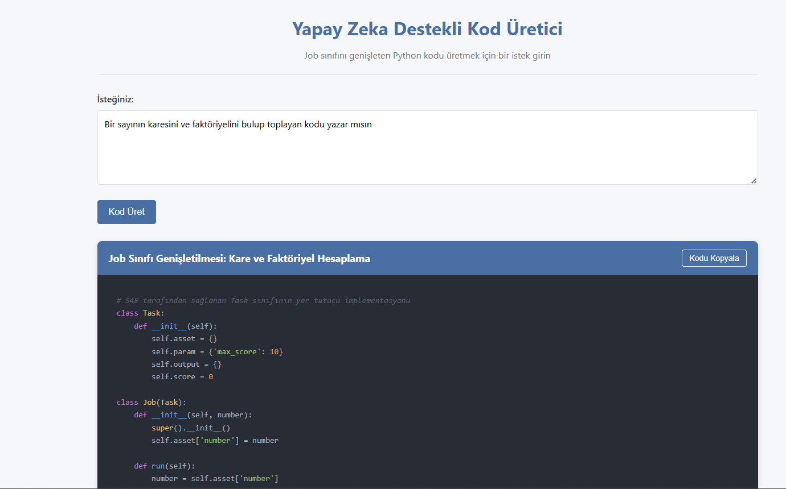
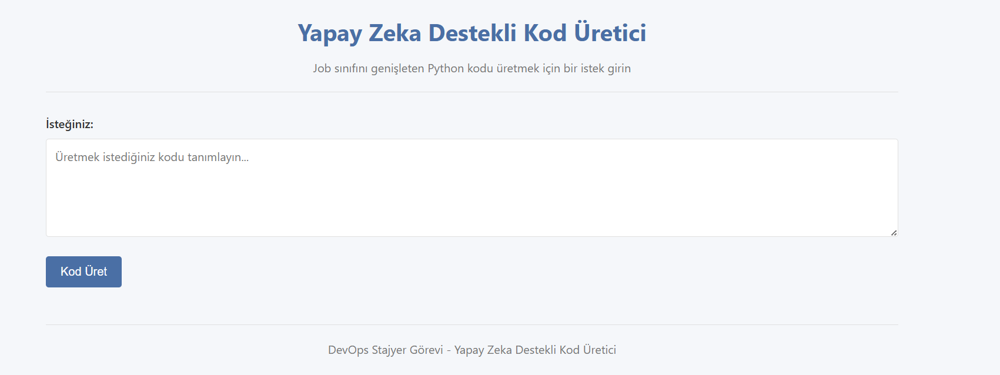
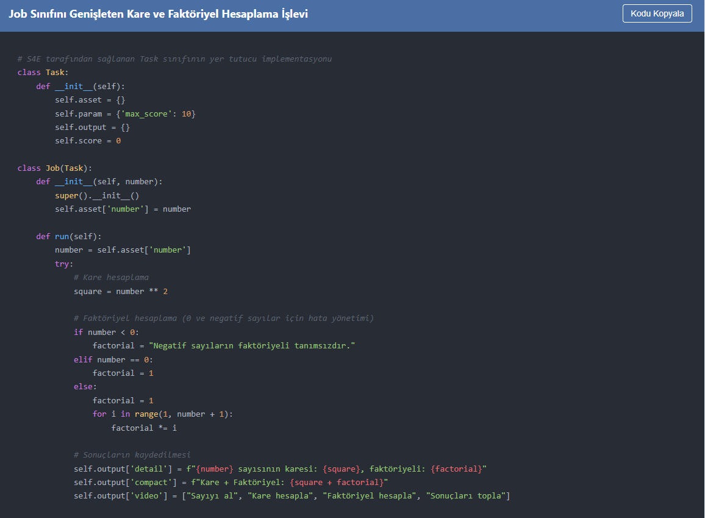

<div align="center">

# 🤖 Yapay Zeka Destekli Kod Üretici

_S4E Şirketi DevOps Stajyer Adayı Mülakat Projesi_

[](https://www.python.org/)
[](https://flask.palletsprojects.com/)
[](https://hub.docker.com/repository/docker/uygaryildizz/s4e-ai-code-generator/general)
[](https://kubernetes.io/)
[](https://ai.google.dev/)



</div>

## 💻 Proje Hakkında

Bu uygulama, yapay zeka kullanarak Python kodu üreten web tabanlı bir asistanı hayata geçirmektedir. Kullanıcılar, basit bir web arayüzü üzerinden isteklerini (prompt) girebilir ve sistem, S4E tarafından sağlanan `Task` sınıfından türetilen `Job` sınıfını genişleten özelleştirilmiş Python kodu üretir.

Bu proje, S4E şirketinin DevOps Stajyer pozisyonu için mülakat projesi olarak geliştirilmiştir. Görev kapsamında, kullanıcıların girdiği prompt'lara göre Python kodu üreten, Minikube üzerinde çalışan ve Helm chart ile dağıtılabilen bir uygulama oluşturulmuştur.

Proje, modern DevOps yaklaşımlarını kullanarak geliştirilmiş olup, Docker konteynerizasyonu ve Kubernetes orkestrasyon yetenekleri ile kolaylıkla ölçeklendirilebilir ve dağıtılabilir bir yapıya sahiptir.

### 🌟 Temel Özellikler

- **Yapay Zeka Entegrasyonu**: Google Gemini 2.5 Flash modeli kullanılarak yüksek kaliteli kod üretimi
- **Alternatif LLM Desteği**: Yerel LLM (Ollama) kullanma seçeneği
- **Kullanıcı Dostu Arayüz**: Sade ve işlevsel web arayüzü
- **Kod Vurgulama**: Üretilen kodlar için sözdizimi vurgulama özelliği
- **Kopyalama İşlevi**: Tek tıkla kodu panoya kopyalama
- **Konteynerizasyon**: Docker ile paketlenmiş uygulama
- **Kubernetes Desteği**: Minikube üzerinde çalışacak şekilde yapılandırılmış
- **Helm Chart**: Gelişmiş Kubernetes dağıtım seçenekleri

## 📦 Kullanım Senaryosu

Bu uygulama, özellikle aşağıdaki senaryolarda faydalıdır:

- **Hızlı Prototipleme**: Geliştiricilerin Job sınıfını temel alan yeni iş sınıfları oluşturması
- **Öğrenme Amaçlı**: Python sınıf kalıtımı ve nesne yönelimli programlama kavramlarını öğrenmek
- **Kod Üretimi Otomasyonu**: Tekrar eden kod kalıplarının hızlıca üretilmesi
- **DevOps Entegrasyonu**: Modern DevOps araçları ile entegre çalışan bir yapay zeka uygulaması örneği

### 💭 Nasıl Çalışır?

1. Kullanıcı, web arayüzünden üretmek istediği kodu tanımlayan bir istek girer
2. Uygulama, bu isteği LLM'ye (Google Gemini 2.5 Flash API veya Ollama) gönderir
3. LLM, S4E'nin Task sınıfından türetilen Job sınıfını genişleten özelleştirilmiş Python kodu üretir
4. Uygulama, yanıtı ayrıştırarak başlık ve kodu çıkarır
5. Sonuçlar, sözdizimi vurgulamasıyla kullanıcıya gösterilir
6. Kullanıcı, üretilen kodu kopyalayabilir veya yeni bir istek girebilir

## 📚 Teknik Gereksinimler

| Gereksinim | Versiyon/Açıklama |
|------------|--------------------|
| Python | 3.8 veya üzeri |
| Docker | En son sürüm |
| Kubernetes | Minikube (yerel geliştirme için) |
| Google Gemini API | Gemini 2.5 Flash modeli için API anahtarı |
| Ollama (opsiyonel) | Yerel LLM kullanımı için |
| Flask | 2.3.3 |
| Gunicorn | 21.2.0 |

## 🔧 Kurulum ve Kullanım

1. Depoyu klonlayın:
   ```
   git clone <repository-url>
   cd ai-code-generator
   ```

2. Sanal ortam oluşturun ve bağımlılıkları yükleyin:
   ```
   python -m venv venv
   source venv/bin/activate  # Windows için: venv\Scripts\activate
   pip install -r requirements.txt
   ```

3. API anahtarınızla bir `.env` dosyası oluşturun:
   ```
   cp .env.example .env
   ```
   `.env` dosyasını düzenleyin ve Gemini API anahtarınızı ekleyin:
   ```
   GEMINI_API_KEY=gemini_api_anahtariniz_buraya
   ```

   Alternatif olarak, Ollama (yerel LLM) kullanmak istiyorsanız, ekleyin:
   ```
   OLLAMA_BASE_URL=http://localhost:11434
   OLLAMA_MODEL=llama2  # veya yüklediğiniz başka bir model
   ```

4. Uygulamayı çalıştırın:
   ```
   python app.py
   ```

5. Tarayıcınızı açın ve `http://localhost:5000` adresine gidin

## Docker ile Oluşturma ve Çalıştırma

1. Docker imajını oluşturun:
   ```
   docker build -t ai-code-generator .
   ```

2. Konteyneri çalıştırın:
   ```
   docker run -p 5000:5000 -e GEMINI_API_KEY=gemini_api_anahtariniz_buraya ai-code-generator
   ```

3. Tarayıcınızı açın ve `http://localhost:5000` adresine gidin

## Kubernetes'e (Minikube) Dağıtım

1. Minikube'u başlatın:
   ```
   minikube start
   ```

2. Docker imajını kullanın:

   **Seçenek 1**: DockerHub'dan çekin:
   ```
   # DockerHub'dan imajı çekin
   docker pull uygaryildizz/s4e-ai-code-generator:latest
   ```

   **Seçenek 2**: Yerel olarak oluşturun:
   ```
   # Minikube'un Docker daemon'ını kullanmak için
   minikube docker-env --shell powershell | Invoke-Expression

   # İmajı oluşturun
   docker build -t s4e-ai-code-generator:latest .
   ```

3. Kubernetes dağıtım dosyasını güncelleyin:

   **Seçenek 1**: DockerHub imajını kullanıyorsanız:
   ```
   # deployment.yaml dosyasını düzenleyin
   # image adını uygaryildizz/s4e-ai-code-generator:latest olarak güncelleyin
   # imagePullPolicy'yi IfNotPresent olarak ayarlayın
   ```

   **Seçenek 2**: Yerel imajı kullanıyorsanız:
   ```
   # deployment.yaml dosyasını düzenleyin
   # image adını s4e-ai-code-generator:latest olarak güncelleyin
   # imagePullPolicy'yi Never olarak ayarlayın
   ```

4. Gemini API anahtarınızla bir secret oluşturun:
   ```
   kubectl create secret generic ai-code-generator-secrets --from-literal=gemini-api-key=gemini_api_anahtariniz_buraya
   ```

5. Kubernetes yapılandırmasını uygulayın:
   ```
   kubectl apply -f kubernetes/deployment.yaml
   ```

6. Uygulamaya erişin:
   ```
   minikube service ai-code-generator
   ```

7. Pod'ların durumunu kontrol edin:
   ```
   kubectl get pods
   ```

## Helm Kullanarak Dağıtım

1. `helm/ai-code-generator/values.yaml` içindeki değerleri güncelleyin:

   **Seçenek 1**: DockerHub imajını kullanıyorsanız:
   - `repository` değerini `uygaryildizz/s4e-ai-code-generator` olarak ayarlayın
   - `pullPolicy` değerini `IfNotPresent` olarak ayarlayın
   - `secrets.geminiApiKey` değerini Gemini API anahtarınızla güncelleyin

   **Seçenek 2**: Yerel imajı kullanıyorsanız:
   - `repository` değerini `s4e-ai-code-generator` olarak ayarlayın
   - `pullPolicy` değerini `Never` olarak ayarlayın
   - `secrets.geminiApiKey` değerini Gemini API anahtarınızla güncelleyin

2. Helm chart'ı yükleyin:
   ```
   helm install ai-code-generator-helm ./helm/ai-code-generator
   ```

3. Helm release'ini kontrol edin:
   ```
   helm list
   kubectl get all
   ```

4. Uygulamaya erişin:
   ```
   minikube service ai-code-generator-helm
   ```

## Proje Yapısı

```
.
├── app/                    # Uygulama kodu
│   ├── __init__.py         # Flask uygulama başlatma
│   ├── models.py           # Job sınıfı tanımı
│   ├── llm_service.py      # LLM entegrasyon servisi
│   ├── routes.py           # Flask rotaları
│   ├── static/             # Statik varlıklar
│   │   ├── css/            # CSS stilleri
│   │   └── js/             # JavaScript dosyaları
│   └── templates/          # HTML şablonları
├── kubernetes/             # Kubernetes yapılandırması
│   ├── deployment.yaml     # Deployment, Service ve Ingress
│   └── secrets.yaml        # Secrets yapılandırması
├── helm/                   # Helm chart
│   └── ai-code-generator/  # Chart dizini
├── .env.example            # Örnek çevre değişkenleri
├── .gitignore              # Git yoksayma dosyası
├── app.py                  # Uygulama giriş noktası
├── Dockerfile              # Docker yapılandırması
├── README.md               # Proje dokümantasyonu
└── requirements.txt        # Python bağımlılıkları
```

## 📸 Ekran Görüntüleri

<div align="center">

<p><i>Ana Sayfa - Kullanıcı İstek Formu</i></p>


<p><i>Üretilen Kod Örneği</i></p>
</div>


## 🚀 Gerçekleştirilen Adımlar

Bu projede aşağıdaki adımlar başarıyla gerçekleştirilmiştir:

1. **Uygulama Geliştirme**:
   - Flask tabanlı web uygulaması geliştirildi
   - Google Gemini 2.5 Flash API entegrasyonu yapıldı
   - Alternatif olarak Ollama (yerel LLM) desteği eklendi
   - S4E tarafından sağlanan Job sınıfı entegre edildi

2. **Konteynerizasyon**:
   - Docker imajı oluşturuldu
   - Minikube'un Docker daemon'ı kullanılarak imaj yerel olarak kaydedildi
   - Docker imajı [DockerHub'a yüklendi](https://hub.docker.com/repository/docker/uygaryildizz/s4e-ai-code-generator/general)

3. **Kubernetes Dağıtımı**:
   - Deployment, Service ve Ingress yapılandırmaları oluşturuldu
   - Secret yönetimi ile API anahtarı güvenli bir şekilde saklandı
   - Minikube üzerinde başarıyla dağıtıldı

4. **Helm Chart**:
   - Gelişmiş dağıtım için Helm chart oluşturuldu
   - Değişken değerler parametrize edildi
   - Helm ile başarıyla dağıtıldı

##  Bilgiler

Bu proje, S4E şirketinin DevOps Stajyer pozisyonu için mülakat projesi olarak geliştirilmiştir. Proje, aşağıdaki teknik gereksinimleri karşılamaktadır:

1. **Model Entegrasyonu**: Google Gemini 2.5 Flash API kullanılarak yapay zeka entegrasyonu sağlanmıştır.
2. **Python ile Entegrasyon**: Python kullanarak LLM API ile bağlantı kurulmuş ve sistem promptu oluşturulmuştur.
3. **Çıktının İşlenmesi**: Modelden gelen cevaptan kod bloğu ve başlık ayrıştırılmıştır.
4. **Uygulamanın Dağıtımı**: Uygulama Minikube üzerinde çalışacak şekilde hazırlanmış, Docker imajı DockerHub'a yüklenmiş ve Helm chart kullanılarak dağıtılmıştır.


## 💬 İletişim

Proje hakkında herhangi bir sorunuz varsa veya daha fazla bilgi almak isterseniz, lütfen iletişime geçin:

- **E-posta**: [uygaryildizz@gmail.com](mailto:uygaryildizz@gmail.com)
- **GitHub**: [github.com/UygarYildiz](https://github.com/UygarYildiz)

---

<div align="center">

© 2024 | S4E DevOps Stajyer Adayı Mülakat Projesi

</div>
